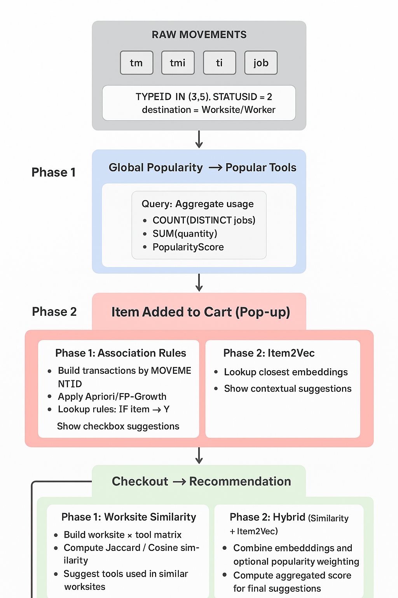

# 📘 MeivRecommendation – Project Flow Documentation (Updated)

## 🔹 **Overview**

The recommendation system is built in **two phases**, evolving from a **basic popularity + association** system to a **contextual recommendation system using Item2Vec**. The goal is to suggest tools efficiently during the ordering process, helping the responsible person (from the tooling department) select the right items, even before the destination (worksite) is known.

---

# **Phase 1 – Popularity + Association Rules**

### 1️⃣ Cart Opened → Popularity Suggestions

**Trigger:** The responsible person opens the cart.

**Recommendation:** **Global Top-N Tools (Passive)**

**Tables:**

* `OSUSR_BBQ_TOOLINGLOGISTICSMOVEMENT` (`tm`) → movements (origin, destination, statusid, typeid)
* `OSUSR_BBQ_TOOLINGLOGISTICSMOVEMENT_TOOLINGITEM` (`tmi`) → tools per movement, quantities
* `OSUSR_CEQ_TOOLINGITEM` (`ti`) → tool metadata (name, category, company id)
* `OSUSR_8DK_JOB` (`job`) → worksite metadata (status, responsible)

**Query (simplified):**

```sql
SELECT
    TOP 20
    ti.NAME AS Tool,
    COUNT(DISTINCT tm.DESTINATIONJOBID) AS DistinctWorksites,
    COUNT(DISTINCT j.RESPONSIBLEID) AS DistinctManagers,
    SUM(tmi.QUANTITY) AS TotalVolume,
    -- Combined score: no. of worksites + log(total_volume + 1)
    COUNT(DISTINCT tm.DESTINATIONJOBID) 
        + 0.5 * LOG(1 + SUM(tmi.QUANTITY)) AS PopularityScore
    FROM OSUSR_BBQ_TOOLINGLOGISTICSMOVEMENT tm
    JOIN OSUSR_BBQ_TOOLINGLOGISTICSMOVEMENT_TOOLINGITEM tmi 
        ON tm.ID = tmi.MOVEMENTID
    JOIN OSUSR_CEQ_TOOLINGITEM ti 
        ON ti.ID = tmi.TOOLINGITEMID
    LEFT JOIN OSUSR_8DK_JOB j 
        ON j.ID = tm.DESTINATIONJOBID AND j.ISDELETED = 0 AND j.JOBSTATUSID IN (3, 4, 5)
    WHERE ti.INTERNALCOMPANYID = 1
        AND ti.ISDELETED = 0
        AND tm.TYPEID IN (3, 5) -- Exit or Transfer
        AND (tm.DESTINATIONJOBID IS NOT NULL OR tm.DESTINATIONWORKERID IS NOT NULL) -- only real use
        AND tm.STATUSID = 2
    GROUP BY ti.NAME
    ORDER BY PopularityScore DESC;
```

**Logic:**

* Shows the most used tools globally.
* Count only **real usage** (`Exit` or `Transfer` to Worksite/Worker).
* Serves as **baseline suggestions** in the cart.

---

### 2️⃣ Item Added → Association Suggestions (Active)

**Trigger:** When the responsible adds a tool to the cart.

**Recommendation:** **Frequently Bought Together (Association Rules)**

**Tables:**

* `tm` + `tmi` → transactional data
* Each movement = one transaction set of tools

**Logic:**

1. Build transactions:

   ```python
   transactions = tmi.groupby('MOVEMENTID')['TOOLINGITEMID'].apply(list).tolist()
   ```
2. Train **Apriori / FP-Growth** rules: `IF Tool A THEN Tool B`

   * Filter rules by support/confidence thresholds
3. At runtime, when adding a tool, show a **pop-up** with suggested tools based on the rules.

   * Example: `Drill → 12mm Drill Bit, Extension Cord`
4. **Important:** No filtering by worksite or manager; purely global co-occurrence.

**Interface:**

* Modal / pop-up:

  * Confirm the main item
  * Checkbox list of “Frequently bought together” tools

---

### 3️⃣ Checkout → Worksite Similarity

**Trigger:** After all items are selected, the responsible goes to the checkout page.

**Recommendation:** **Suggest tools based on similar worksites**

**Tables:**

* `tm` + `tmi` → movements per worksite
* `ti` → tool metadata
* `job` → worksite metadata

**Logic:**

1. Build **worksite × tool matrix** (rows = worksites, columns = tools, binary 1/0 if used)
2. Compute similarity between worksites using:

   * **Jaccard similarity** (intersection/union of tools used)
   * **Cosine similarity** (if using counts instead of binary)
3. Suggest tools used in **similar worksites** but not yet in the cart

**Optional:** Aggregate similar worksites to create **recommendation score per tool**

---

# **Phase 2 – Adding Item2Vec for Contextual Recommendations**

Phase 2 includes **all logic from Phase 1** but adds **Item2Vec embeddings** for tools.

### 1️⃣ Item2Vec Training

**Purpose:** capture **latent relationships between tools**, going beyond explicit co-occurrence.

**Steps:**

1. Build **movements as sentences**:

   ```python
   sentences = tmi.groupby('MOVEMENTID')['TOOLINGITEMID'].apply(list).tolist()
   ```
2. Train **Word2Vec / Skip-gram** embeddings:

   ```python
   from gensim.models import Word2Vec

   model = Word2Vec(
       sentences=sentences,
       vector_size=50,
       window=5,
       min_count=1,
       sg=1, # Skip-gram
       workers=4,
       epochs=50
   )
   ```
3. Save embeddings for runtime queries.

---

### 2️⃣ Item Added → Item2Vec Suggestions

**Trigger:** When the responsible adds a tool to the cart.

**Logic:**

* Lookup **closest tools in embedding space**:

  ```python
  suggestions = model.wv.most_similar('Drill', topn=5)
  ```
* Show in pop-up as **complementary tools**, alongside or replacing Apriori rules.
* Advantages:

  * Can suggest tools **never seen together before** but contextually related
  * Works even if the worksite is unknown

---

### 3️⃣ Checkout → Hybrid Recommendation

**Logic:**

* Combine outputs:

  * **Worksite similarity** (historical similar worksites)
  * **Item2Vec embeddings** (contextual associations)
  * Optionally **global popularity** as fallback
* Compute **aggregated score**:

  ```text
  score = 0.3*Popularity + 0.4*Association/Item2Vec + 0.3*Similarity
  ```
* Suggest top-ranked tools not yet in the cart

---

# 🔹 **Data Flow – Updated**

```plaintext
[Cart Opened] 
       │
       ▼
[Global Popularity Top-N]  <-- Baseado em contagem/volume (PopularityScore)
       │
       ▼
[Item Added to Cart]
       │
       ├── Phase 1: FP-Growth / Apriori  --> Sugestões de ferramentas "frequentemente compradas juntas"
       │
       └── Phase 2: Item2Vec           --> Sugestões contextuais (relacionadas, mesmo sem co-ocorrência)
       │
       ▼
[Checkout]
       │
       ├── Worksite Similarity
       │       ├── Jaccard (binário: ferramenta usada ou não)
       │       └── Cosine (quantidade/volume de ferramentas)
       │
(Optional)-->  └── Hybrid Recommendation (Phase 2)
               ├── Combine:
               │       • Global Popularity
               │       • Item2Vec embeddings
               │       • Worksite Similarity
               └── Calculate score grouped and suggest top-ranked tools
       │
       ▼
[Finalize Order]

```



---


### 📌 **Recommendation Timing Summary**

To make it explicit when each recommendation strategy is applied, the system will follow this flow:

| **Order Stage**         | **Manager Action**                  | **Recommendation Type**                                                      | **Data Source / Logic**                                   | **Objective**                                                                                        |
| ----------------------- | ----------------------------------- | ---------------------------------------------------------------------------- | --------------------------------------------------------- | ---------------------------------------------------------------------------------------------------- |
| **1. Open Cart**        | Just enters the cart (empty or not) | **Global Popularity (Top-N)** – *passive* recommendation                     | Query 2 (PopularityScore based on global usage history)   | Inspire and speed up the order with most popular tools.                                              |
| **2. Add Item to Cart** | Clicks to include a tool            | **Association (Apriori / FP-Growth)** – *active* recommendation              | Query 1 (transactions → co-occurrence of tools)           | Suggest items frequently ordered together with the selected tool.                                    |
| **3. Checkout**         | Goes to finalize the order          | **Worksite Similarity (Jaccard / Similarity)** – *contextual* recommendation | Worksite × Tool matrix (similarity between jobs/projects) | Complete the order, preventing missing items by suggesting tools commonly used in similar worksites. |


---

# 🔹 **Table / Query Mapping per Stage**

| Stage       | Tables                   | Query / Logic                                                                                                                                       |
| ----------- | ------------------------ | --------------------------------------------------------------------------------------------------------------------------------------------------- |
| Cart Opened | `tm`, `tmi`, `ti`, `job` | Aggregate global popularity (`PopularityScore`)                                                                                                     |
| Add Item    | `tm`, `tmi`              | Phase 1: Apriori rules on transactions (movement ID → list of tools) <br> Phase 2: Item2Vec embeddings for contextual suggestions                   |
| Checkout    | `tm`, `tmi`, `ti`, `job` | Worksite × tool matrix → compute similarity → suggest missing tools <br> Phase 2: combine with Item2Vec suggestions + optional popularity weighting |


-----
✅ **Notes / Best Practices**

* Always filter **real usage movements**: `Exit` or `Transfer` to Worksite/Worker
* Phase 1 recommendations are **global**, independent of worksite or responsible
* Phase 2 adds **contextual similarity**, allowing better recommendations for rare or new combinations
* Data pipelines should maintain:

  * Movement history (`tm`, `tmi`)
  * Tool metadata (`ti`)
  * Worksite metadata (`job`)

---

